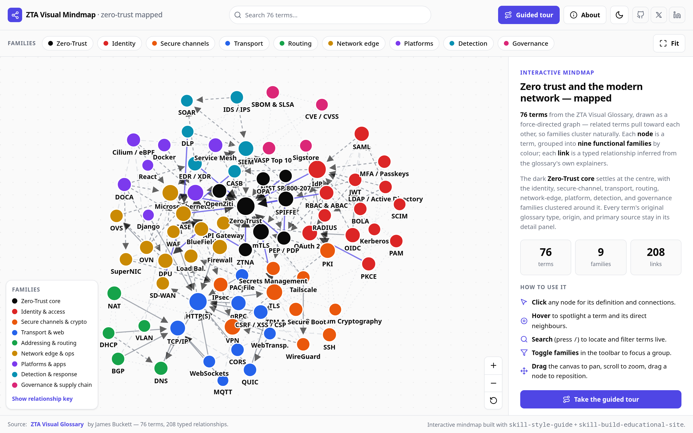

# ZTA Visual Mindmap

> Interactive force-directed mindmap of 76 zero-trust, networking & IT terms.

## About

Maps 76 IT, networking, and zero-trust terms from the [ZTA Visual Glossary](https://zta-visual-glossary.vercel.app/) as an interactive, force-directed graph. Groups nodes into nine functional families by colour and links them with five typed relationships — requires, enables, part-of, alternative, and same-category — inferred from each term's own explainer. Lets you click any node for its definition and connections, search and filter live, toggle light or dark, or follow a guided tour anchored on Zero Trust. Ships as a single self-contained `index.html` with no build step, no server, and no runtime dependencies.

## Usage

Open `index.html` in any modern browser — double-click it, or serve the folder. Nothing to install; the page is fully self-contained, with the dataset embedded inline.

- **Click** a node for its definition, tags, origin, primary source, and typed connections.
- **Hover** to spotlight a term and its direct neighbours, dimming the rest.
- **Search** (or press `/`) to locate and filter terms live.
- **Toggle families** in the toolbar to focus a group.
- **Guided tour** walks the core zero-trust concepts in a suggested learning order.
- **Drag** the canvas to pan, scroll to zoom, drag a node to reposition; keyboard and screen-reader navigable.

`zta-glossary-data.json` is the same dataset as a standalone file — 76 terms and 208 typed edges — for reuse outside the page.

## Contributing

Issues and pull requests welcome. Please open an issue first to discuss substantial changes.

## License

[MIT](LICENSE) © 2026 James Buckett
