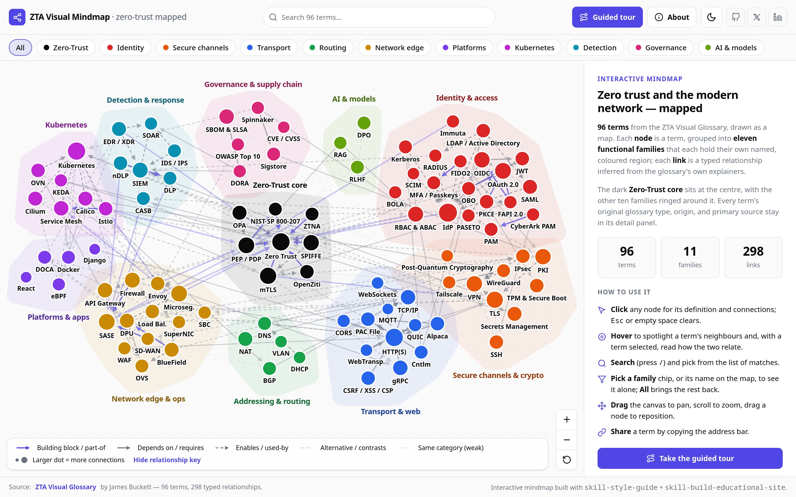

# Visual Tech Mindmap

> Interactive force-directed mindmap of 104 IT, AI, networking & security terms.

## About

Maps 104 IT, AI, networking, and security terms from the [Visual Tech Glossary](https://zta-visual-glossary.vercel.app/) as an interactive, force-directed graph. Groups nodes into eleven functional families, each in its own named, colour-coded region around a Zero-Trust core, and links them with five typed relationships — requires, enables, part-of, alternative, and same-category — inferred from each term's own explainer. Lets you click any node for its definition, primary source, and connections, search and filter live, toggle light or dark, or follow an 11-step guided tour anchored on Zero Trust. Ships as a single self-contained `index.html` with no build step, no server, and no runtime dependencies.

## Usage

Open `index.html` in any modern browser — double-click it, or serve the folder. Nothing to install; the page is fully self-contained, with the dataset embedded inline.

- **Click** a node for its definition, tags, origin, primary source, and typed connections; click empty space or press `Esc` to clear.
- **Hover** to spotlight a term and its direct neighbours, dimming the rest; with a term selected, the tooltip states how the two relate.
- **Search** (or press `/`) to list matching terms, best match first, and open one with `Enter`.
- **Pick a family** chip, or a family name on the map, to see that family alone; add others, or press **All** to restore the map.
- **Share** a term by copying the address bar — the URL hash tracks the selection, and Back/Forward retrace your steps.
- **Guided tour** walks the core zero-trust concepts in a suggested learning order.
- **Drag** the canvas to pan, scroll to zoom, drag a node to reposition; arrow keys move between neighbouring nodes, and the map is screen-reader navigable.

`zta-glossary-data.json` is the same dataset as a standalone file — 104 terms and 329 typed edges — for reuse outside the page.

## Contributing

Issues and pull requests welcome. Please open an issue first to discuss substantial changes.

## License

[MIT](LICENSE) © 2026 James Buckett
